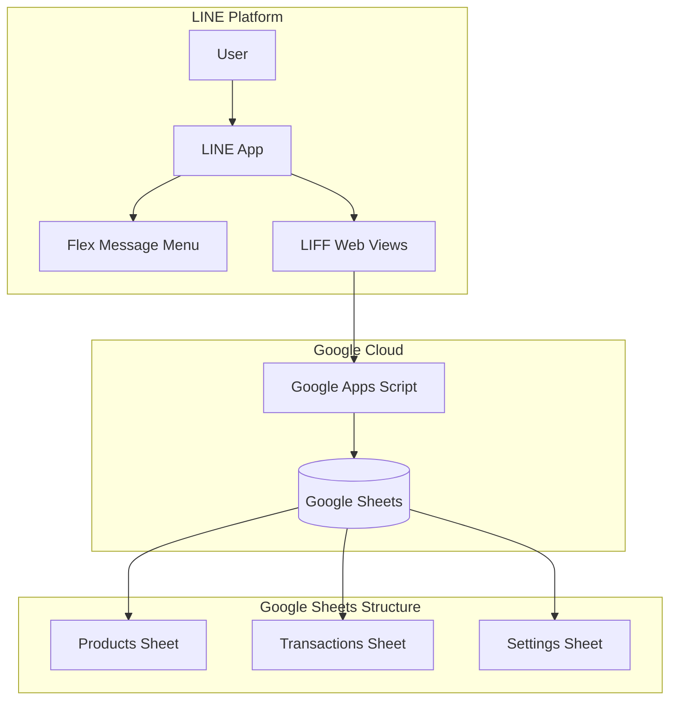

# Design Document: LINE Inventory Management System

## Overview

ระบบจัดการสินค้าคงคลังผ่าน LINE OA ที่ใช้ Google Sheets เป็นฐานข้อมูล และ Google Apps Script เป็น backend โดยมี LIFF (LINE Front-end Framework) เป็น web interface สำหรับการทำงานต่างๆ

### Technology Stack
- **Frontend**: LIFF (HTML/CSS/JavaScript) hosted on Google Apps Script
- **Backend**: Google Apps Script (doGet/doPost endpoints)
- **Database**: Google Sheets
- **Messaging**: LINE Messaging API (Flex Messages)

## Architecture



## Components and Interfaces

### 1. LINE Messaging Component

```
Interface: LineMessaging
├── sendFlexMenu(userId: string): void
├── sendConfirmation(userId: string, message: string): void
└── replyMessage(replyToken: string, messages: Message[]): void
```

**Flex Message Menu Structure:**
```json
{
  "type": "flex",
  "altText": "เมนูจัดการคลังสินค้า",
  "contents": {
    "type": "bubble",
    "body": {
      "type": "box",
      "layout": "vertical",
      "contents": [
        { "type": "text", "text": "📦 ระบบคลังสินค้า" },
        {
          "type": "box",
          "layout": "horizontal",
          "contents": [
            { "type": "button", "action": { "type": "uri", "label": "จัดการสินค้า", "uri": "LIFF_URL/products" }},
            { "type": "button", "action": { "type": "uri", "label": "เบิกสินค้า", "uri": "LIFF_URL/withdraw" }}
          ]
        },
        {
          "type": "box",
          "layout": "horizontal", 
          "contents": [
            { "type": "button", "action": { "type": "uri", "label": "รับเข้า", "uri": "LIFF_URL/receive" }},
            { "type": "button", "action": { "type": "uri", "label": "รายงาน", "uri": "LIFF_URL/reports" }}
          ]
        },
        { "type": "button", "action": { "type": "uri", "label": "📊 Dashboard", "uri": "LIFF_URL/dashboard" }}
      ]
    }
  }
}
```

### 2. Apps Script API Component

```
Interface: InventoryAPI
├── doGet(e: Event): HtmlOutput | TextOutput
├── doPost(e: Event): TextOutput
├── handleLineWebhook(event: LineEvent): void
└── serveHtml(page: string): HtmlOutput
```

**API Endpoints (via query parameters):**
| Endpoint | Method | Description |
|----------|--------|-------------|
| ?page=products | GET | Product management page |
| ?page=withdraw | GET | Withdrawal page |
| ?page=receive | GET | Receipt page |
| ?page=dashboard | GET | Dashboard page |
| ?page=reports | GET | Reports page |
| ?action=getProducts | GET | Get all products |
| ?action=addProduct | POST | Add new product |
| ?action=updateProduct | POST | Update product |
| ?action=deleteProduct | POST | Delete product |
| ?action=withdraw | POST | Process withdrawal |
| ?action=receive | POST | Process receipt |
| ?action=getLogs | GET | Get transaction logs |
| ?action=getReport | GET | Get filtered report |

### 3. Product Service Component

```
Interface: ProductService
├── getAllProducts(): Product[]
├── getProductByCode(code: string): Product | null
├── addProduct(product: ProductInput): Result
├── updateProduct(code: string, updates: ProductUpdate): Result
├── deleteProduct(code: string, userName: string): Result
├── searchProducts(query: string): Product[]
└── getLowStockProducts(): Product[]
```

### 4. Transaction Service Component

```
Interface: TransactionService
├── withdraw(productCode: string, quantity: number, userName: string): Result
├── receive(productCode: string, quantity: number, userName: string): Result
├── getTransactionLogs(filters: LogFilter): Transaction[]
├── createLog(log: TransactionLog): void
└── getReport(filters: ReportFilter): ReportData
```

### 5. Sheet Service Component

```
Interface: SheetService
├── getSheet(sheetName: string): Sheet
├── readData(sheetName: string): any[][]
├── writeRow(sheetName: string, row: any[]): void
├── updateRow(sheetName: string, rowIndex: number, row: any[]): void
├── deleteRow(sheetName: string, rowIndex: number): void
├── findRow(sheetName: string, column: number, value: any): number
└── acquireLock(): Lock
```

## Data Models

### Product Model
```typescript
interface Product {
  code: string;           // รหัสสินค้า (unique)
  name: string;           // ชื่อสินค้า
  unit: string;           // หน่วย (ชิ้น, กล่อง, etc.)
  quantity: number;       // จำนวนคงเหลือ
  lowStockThreshold: number; // จุดเตือนสินค้าใกล้หมด
  category: string;       // หมวดหมู่
  createdAt: string;      // วันที่สร้าง
  updatedAt: string;      // วันที่แก้ไขล่าสุด
}
```

### Transaction Model
```typescript
interface Transaction {
  id: string;             // รหัสรายการ (auto-generated)
  timestamp: string;      // วันเวลาที่ทำรายการ
  type: 'WITHDRAW' | 'RECEIVE' | 'EDIT' | 'DELETE' | 'CREATE';
  productCode: string;    // รหัสสินค้า
  productName: string;    // ชื่อสินค้า
  quantity: number;       // จำนวนที่ทำรายการ
  beforeQuantity: number; // จำนวนก่อนทำรายการ
  afterQuantity: number;  // จำนวนหลังทำรายการ
  userName: string;       // ชื่อผู้ทำรายการ
  note: string;           // หมายเหตุ
}
```

### Report Filter Model
```typescript
interface ReportFilter {
  startDate?: string;
  endDate?: string;
  productCode?: string;
  category?: string;
  transactionType?: string;
  userName?: string;
}
```

### Result Model
```typescript
interface Result {
  success: boolean;
  message: string;
  data?: any;
}
```

## Google Sheets Structure

### Products Sheet
| Column | Field | Type |
|--------|-------|------|
| A | code | string |
| B | name | string |
| C | unit | string |
| D | quantity | number |
| E | lowStockThreshold | number |
| F | category | string |
| G | createdAt | datetime |
| H | updatedAt | datetime |

### Transactions Sheet
| Column | Field | Type |
|--------|-------|------|
| A | id | string |
| B | timestamp | datetime |
| C | type | string |
| D | productCode | string |
| E | productName | string |
| F | quantity | number |
| G | beforeQuantity | number |
| H | afterQuantity | number |
| I | userName | string |
| J | note | string |

### Settings Sheet
| Column | Field | Type |
|--------|-------|------|
| A | key | string |
| B | value | string |


## Correctness Properties

*A property is a characteristic or behavior that should hold true across all valid executions of a system—essentially, a formal statement about what the system should do. Properties serve as the bridge between human-readable specifications and machine-verifiable correctness guarantees.*

### Property 1: Product CRUD Round-Trip

*For any* valid product input, adding the product and then retrieving it by code should return an equivalent product with matching code, name, unit, quantity, and threshold values.

**Validates: Requirements 2.2**

### Property 2: Product Update Consistency

*For any* existing product and valid update data, updating the product and then retrieving it should reflect all the updated values while preserving unchanged fields.

**Validates: Requirements 2.3**

### Property 3: Product Deletion Completeness

*For any* existing product, after deletion, retrieving the product by code should return null, and a transaction log entry of type 'DELETE' should exist for that product.

**Validates: Requirements 2.4**

### Property 4: Product Code Uniqueness

*For any* two product creation attempts with the same product code, only the first should succeed, and the second should return an error result with success=false.

**Validates: Requirements 2.5, 2.6**

### Property 5: Withdrawal Stock Validation

*For any* withdrawal request where the requested quantity exceeds the current stock, the system should reject the request (success=false) and the product quantity should remain unchanged.

**Validates: Requirements 3.2, 3.3**

### Property 6: Withdrawal Quantity Deduction

*For any* valid withdrawal (quantity <= stock), the product's quantity after withdrawal should equal (beforeQuantity - withdrawnQuantity), and a transaction log should be created with correct before/after values.

**Validates: Requirements 3.4**

### Property 7: Receipt Quantity Addition

*For any* valid receipt (positive quantity), the product's quantity after receipt should equal (beforeQuantity + receivedQuantity), and a transaction log should be created with correct before/after values.

**Validates: Requirements 4.2**

### Property 8: Transaction User Name Requirement

*For any* withdrawal or receipt request with an empty or whitespace-only userName, the system should reject the request (success=false) and no changes should be made to product quantity.

**Validates: Requirements 3.5, 4.3, 9.1**

### Property 9: Positive Quantity Validation

*For any* receipt request with quantity <= 0, the system should reject the request (success=false) and no changes should be made to product quantity.

**Validates: Requirements 4.5**

### Property 10: Low Stock Detection

*For any* set of products, getLowStockProducts should return exactly those products where quantity <= lowStockThreshold, and no products where quantity > lowStockThreshold.

**Validates: Requirements 5.2, 5.3**

### Property 11: Dashboard Statistics Accuracy

*For any* set of products, the dashboard should show: totalProducts equal to product count, and lowStockCount equal to the count of products where quantity <= threshold.

**Validates: Requirements 5.1**

### Property 12: Transaction Log Completeness

*For any* transaction (withdraw/receive/edit/delete), a log entry should exist containing: timestamp, type, productCode, productName, quantity, beforeQuantity, afterQuantity, and userName (all non-empty for required fields).

**Validates: Requirements 6.1, 9.2**

### Property 13: Log Filtering Correctness

*For any* filter criteria (date range, type, product, userName), getTransactionLogs should return only logs that match ALL specified filter criteria, sorted by timestamp in descending order.

**Validates: Requirements 6.2, 6.3**

### Property 14: Report Summary Accuracy

*For any* filtered transaction set, the report summary should show: totalWithdrawals equal to sum of WITHDRAW quantities, totalReceipts equal to sum of RECEIVE quantities, and netChange equal to (totalReceipts - totalWithdrawals).

**Validates: Requirements 7.2, 7.3**

## Error Handling

### Input Validation Errors
| Error Code | Condition | Message |
|------------|-----------|---------|
| E001 | Empty product code | รหัสสินค้าไม่สามารถว่างได้ |
| E002 | Duplicate product code | รหัสสินค้านี้มีอยู่แล้วในระบบ |
| E003 | Empty product name | ชื่อสินค้าไม่สามารถว่างได้ |
| E004 | Invalid quantity (negative) | จำนวนต้องเป็นตัวเลขที่มากกว่า 0 |
| E005 | Withdrawal exceeds stock | จำนวนเบิกเกินจำนวนคงเหลือ (คงเหลือ: X) |
| E006 | Empty user name | กรุณาระบุชื่อผู้ทำรายการ |
| E007 | Product not found | ไม่พบสินค้ารหัส: X |

### System Errors
| Error Code | Condition | Message |
|------------|-----------|---------|
| E100 | Sheet not found | ไม่พบ Sheet ที่ต้องการ |
| E101 | Lock timeout | ระบบกำลังประมวลผล กรุณาลองใหม่ |
| E102 | Invalid request | คำขอไม่ถูกต้อง |

### Error Response Format
```typescript
interface ErrorResult {
  success: false;
  errorCode: string;
  message: string;
}
```

## Testing Strategy

### Unit Tests
Unit tests จะใช้สำหรับทดสอบ specific examples และ edge cases:
- ทดสอบการสร้างสินค้าด้วยข้อมูลตัวอย่าง
- ทดสอบ edge cases เช่น empty string, zero quantity
- ทดสอบ error conditions ต่างๆ

### Property-Based Tests
Property-based tests จะใช้ทดสอบ universal properties ที่ต้องเป็นจริงสำหรับทุก input:
- ใช้ **fast-check** library สำหรับ JavaScript/TypeScript
- แต่ละ property test จะรัน minimum 100 iterations
- ทุก test จะ annotate ด้วย property number และ requirements ที่ validate

### Test Configuration
```javascript
// fast-check configuration
fc.configureGlobal({
  numRuns: 100,
  verbose: true
});
```

### Test Annotation Format
```javascript
// Feature: line-inventory-management, Property 5: Withdrawal Stock Validation
// Validates: Requirements 3.2, 3.3
test('withdrawal should reject when quantity exceeds stock', () => {
  fc.assert(
    fc.property(
      productArbitrary,
      fc.integer({ min: 1 }),
      (product, extraQuantity) => {
        const withdrawQuantity = product.quantity + extraQuantity;
        const result = withdraw(product.code, withdrawQuantity, 'TestUser');
        return result.success === false;
      }
    )
  );
});
```

### Test Categories
1. **Product Service Tests** - Properties 1-4
2. **Transaction Service Tests** - Properties 5-9
3. **Dashboard/Report Tests** - Properties 10-14
